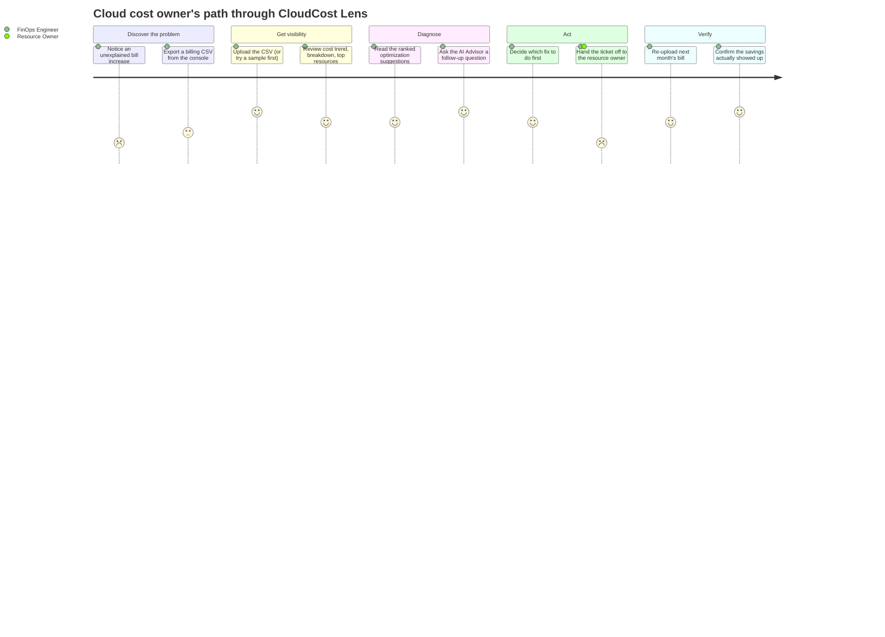
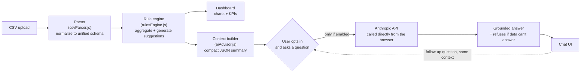

# User journey & conversation flow

Two views of the same product: the human journey (what someone experiences), and the system flow (what actually happens when they use the AI Cost Advisor). Both render natively as diagrams on GitHub.

## 1. The human journey

The primary persona is a **FinOps / cloud engineer** at a company without a dedicated FinOps team — someone who owns cloud cost as one part of a broader job, not their whole job. The satisfaction score (1-5) reflects where the friction actually is: getting to a trustworthy answer is easy, the hard part is what happens *after* the tool tells you something.

**Where the dips are, on purpose:** "notice an unexplained bill increase" scores low because that moment is stressful and reactive by nature — no tool fixes that, it just shortens what comes after. "Hand the ticket off to the resource owner" also dips, because this tool deliberately stops at *recommending*, not *acting* — see the handoff-points discussion in [prompt-library.md](prompt-library.md). That boundary is a real product decision (a FinOps tool that can unilaterally terminate someone else's resource is a very different, much higher-trust product), not a gap that was missed.

## 2. The AI Advisor's conversation flow

This is the system-level view of what happens between a click and an answer — the "agent" here is intentionally simple (no tool use, no multi-step planning) because the trust bar for a cost-advisory feature should be earned before the scope grows.

**Why the context builder is its own box:** the model never receives the raw parsed rows — only the already-aggregated totals, breakdowns, top resources, and the rule engine's own suggestions. This keeps the "conversation" grounded in numbers that were already computed and are already visible on the dashboard, rather than asking the model to re-derive them from scratch (smaller prompt, and no room for the model to make its own arithmetic mistake on data it can already see rendered as a chart two inches above the chat box).

**Why there's no auto-loop back into the rule engine:** a more ambitious version of this agent could take the conversation's outcome (e.g., "user confirmed suggestion #2 is being actioned") and feed it back to suppress that suggestion next session. That's a deliberate v2 idea, not built — the loop above stops at the chat UI so the boundary between "advisory" and "state-changing" stays visible.
